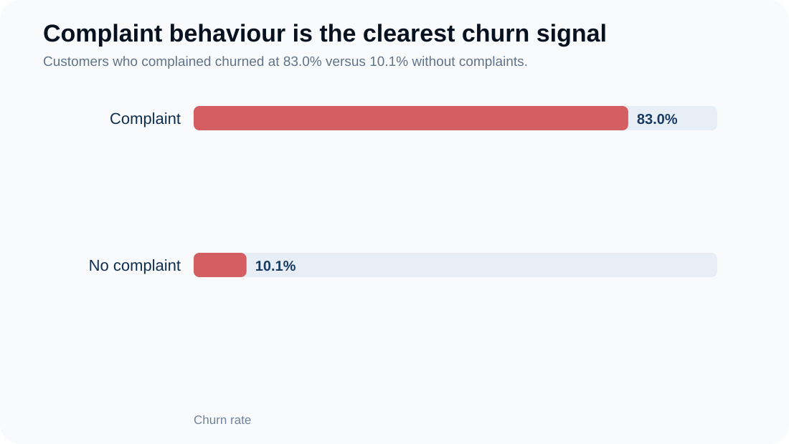
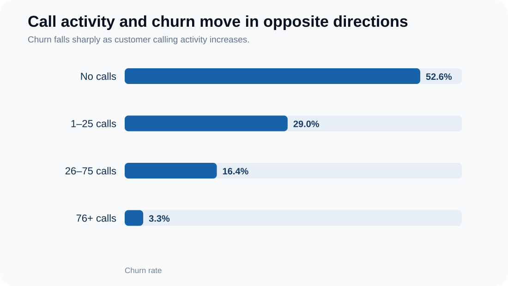
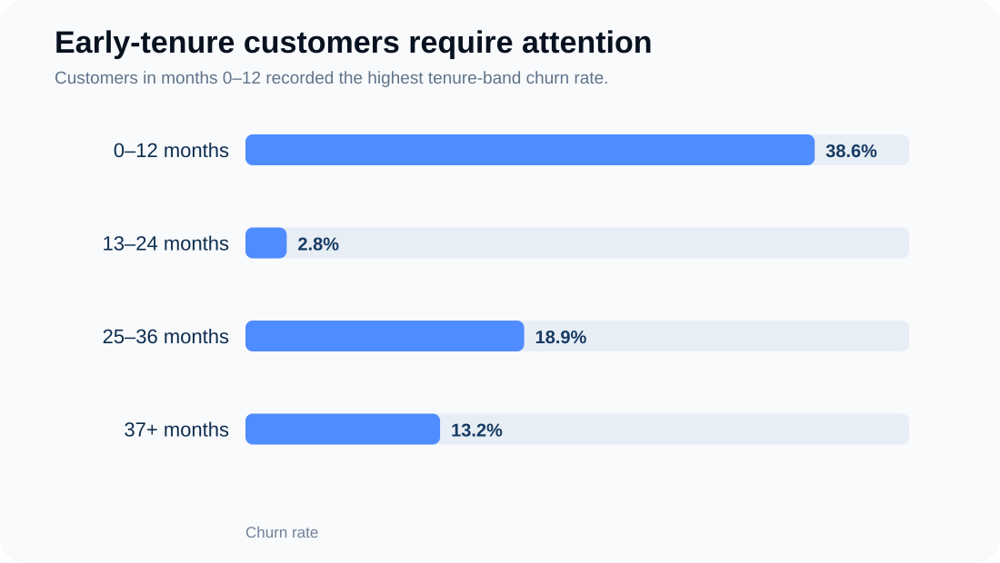
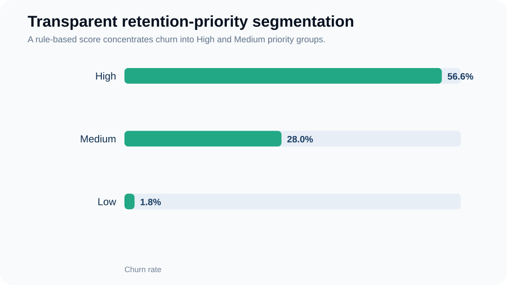

# Telecom Customer Churn & Retention Intelligence

**Python • Pandas • Matplotlib • Jupyter**

A customer-retention analytics project using a real telecom dataset from the UCI Machine Learning Repository.

## Business question

> Which behavioural and service signals are most strongly associated with customer churn, and which customer groups should the telecom company prioritise for retention?

The project focuses on **decision support**, not black-box prediction. It uses Python/Pandas to clean and segment the data, Matplotlib for visual analysis, and a transparent retention-priority heuristic to translate findings into action.

## Dataset

The Iranian Churn dataset contains **3,150 customers** from a real Iranian telecom company's database collected over 12 months. UCI states that behavioural features are aggregated over the first 9 months and churn status is observed at the end of month 12.

Source: https://archive.ics.uci.edu/dataset/563/iranian+churn+dataset  
DOI: https://doi.org/10.24432/C5JW3Z  
Licence: **CC BY 4.0**

## Headline findings

- **15.7% overall churn** — 495 of 3150 customers.
- Customers who **complained churned at 83%**, versus 10.1% without complaints.
- **Non-active customers churned at 47.3%**, versus 5.3% among active customers.
- Customers with **no call activity churned at 52.6%**; customers with 76+ calls churned at only 3.3%.
- Customers in their first **0–12 months recorded 38.6% churn**.
- Pay-as-you-go customers recorded **16.8% churn**, compared with 2.4% for contractual customers.

## Retention priority

A transparent business-rule score was created from complaint, activity, tenure and tariff signals.

| Priority | Customers | Churn rate |
|---|---:|---:|
| High | 549 | 56.6% |
| Medium | 522 | 28% |
| Low | 2079 | 1.8% |

The score is a **heuristic for retention triage**, not a machine-learning churn probability.

## Visual analysis

### Complaint behaviour



### Call engagement



### Early tenure



### Retention priority



## Project structure

```
01_notebook/
    telecom_churn_analysis.ipynb

02_data/
    README.md
    raw/
        Customer_Churn.csv
    cleaned/
        telecom_churn_cleaned.csv

03_visuals/
    complaint-vs-churn.svg
    call-activity-vs-churn.svg
    tenure-vs-churn.svg
    retention-priority.svg

04_outputs/
    README.md
    retention_priority_segments.csv
    high_priority_records.csv

05_documentation/
    findings_and_recommendations.md

requirements.txt
```

## Skills demonstrated

- Python/Pandas data cleaning
- feature labelling and segmentation
- grouped analysis and KPI calculation
- customer-behaviour analysis
- Matplotlib visualisation
- transparent business-rule scoring
- evidence-based recommendations
- analytical limitations and responsible interpretation

## Important analytical choices

The source field `Charge Amount` is ordinal (0–9), not currency. The project therefore avoids inventing a monetary revenue-at-risk figure.

The project also treats churn drivers as **associations**, not causal claims.

## Reproduce the analysis

```bash
pip install -r requirements.txt
jupyter notebook
```

Open `01_notebook/telecom_churn_analysis.ipynb` and run the cells from top to bottom.

## Portfolio case study

View the full case study: https://mayfuns.github.io/mariam-analytics-portfolio/telecom-churn.html
